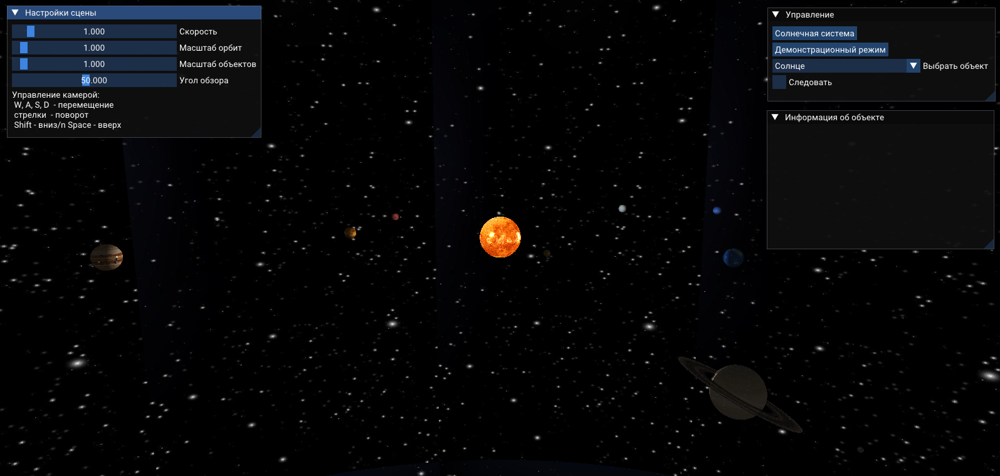
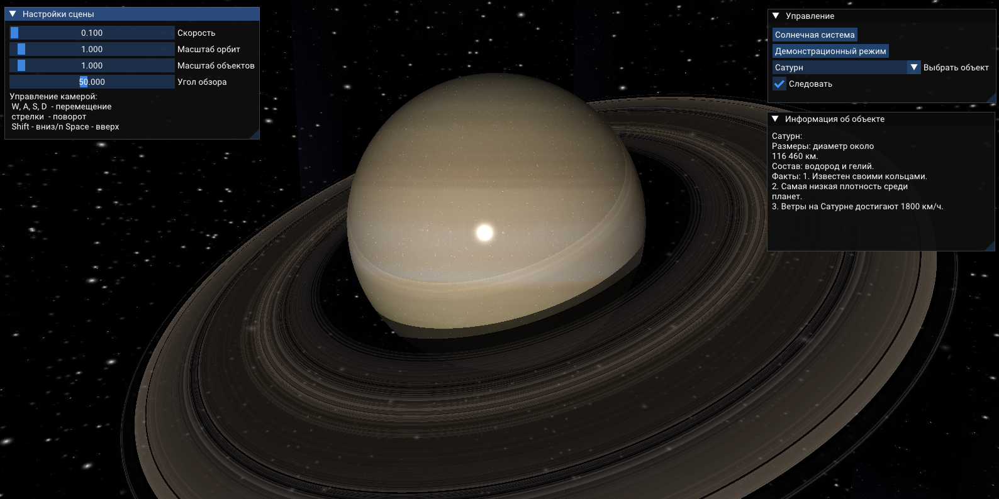
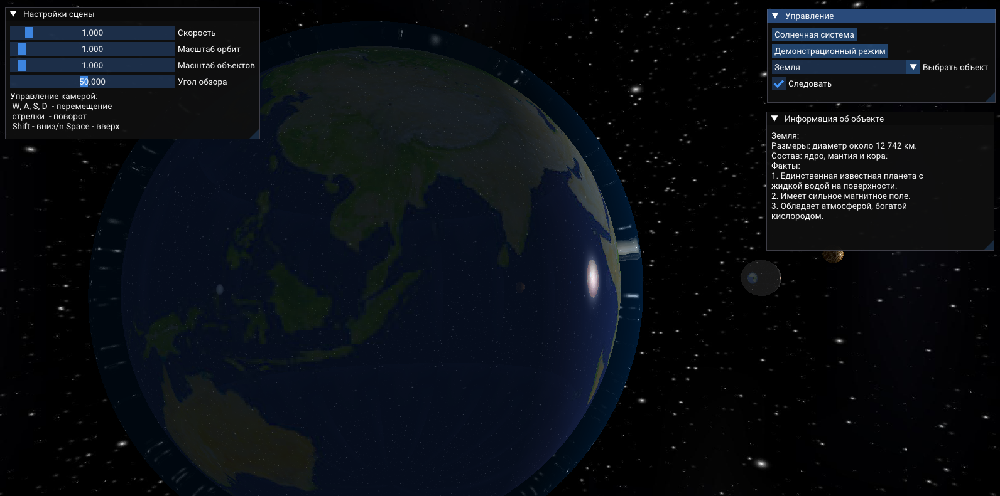

# RayTracingSolarSystem
Моя реализация модели Солнечной системы с помощью трассировки лучей.
В этой версии реализованы:
- взаимные тени, преломления лучей, модель освещения Фонга, зеркальные отражения
- перемещение камеры
- текстуры
- кольца Сатурна
- перемещение между объектами
- следование за объектом
- справочная информация

# Примеры работы

